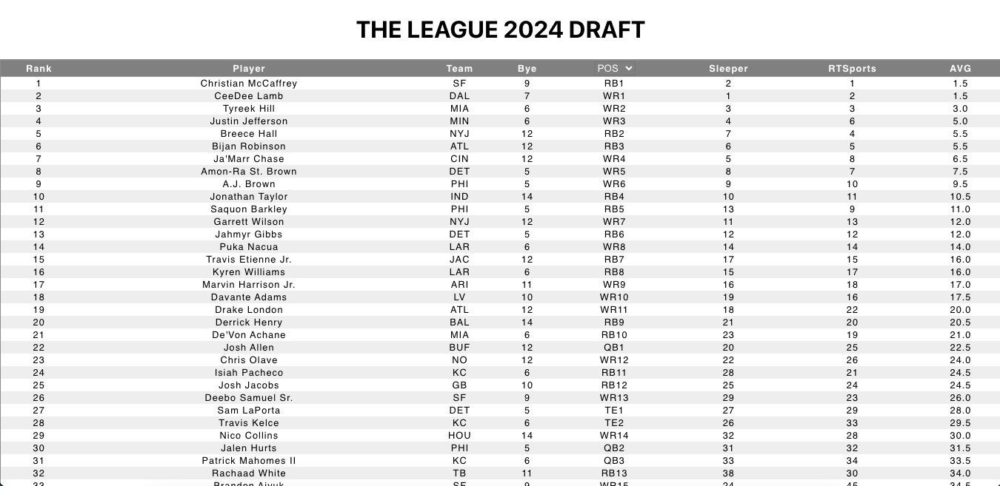

# FFL
FFL is intended as an in-person Fantasy Football draft companion website, allowing team managers to view what players are available and their ADP (average draft position).

## Why
Having really enjoyed in-person drafts, my 10-year running league wished to continue to have them, but several members have moved hundreds of miles away, so a system was needed to allow for them to know who is available to draft, enabling them to easily call in their picks.

## What's Next
*  Add views that allow managers to check their current team so they can compare to the available list to figure out who to draft next.
*  Migrate from using a csv file to a database
*  Add option to table to add back in drafted players, (most likely will be grayed out)
*  Add draft queue list, so managers can load their plan into the site prior or during draft

